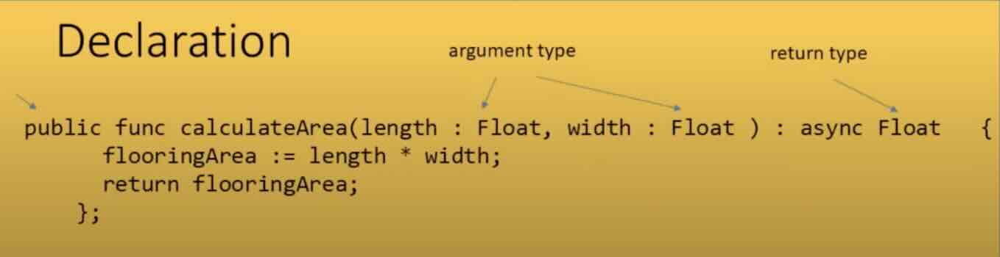

# Functions

To organize the code in a program well, we use functions. In addition to improving readability, they allow us to reuse our code.

Functions typically accept arguments and return a value of a specific type.
It is possible for a function to not return a value - `()`

Types of functions:
- **Public**: Can be accessed outside the scope of the module/actor in which they are defined.
- **Public Shared**: Can be accessed by other canisters/contracts.
- **Public Query**: Does not go through consensus - fast performance ~100ms. By default, query functions are shared.
- **Private**: Accessible only within the module/actor.
- **Async**: Return an immediate promise, allowing the caller not to wait for the final response (result).
